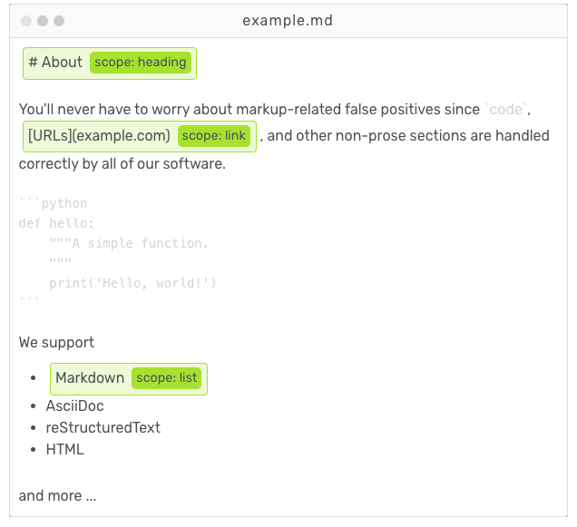
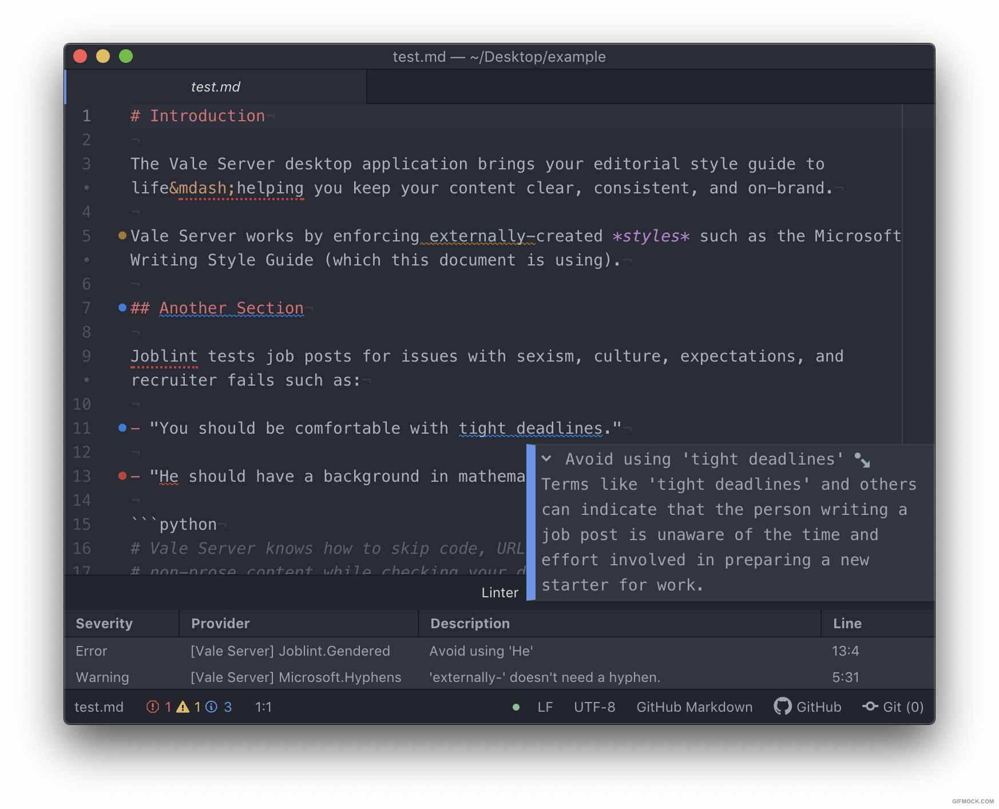
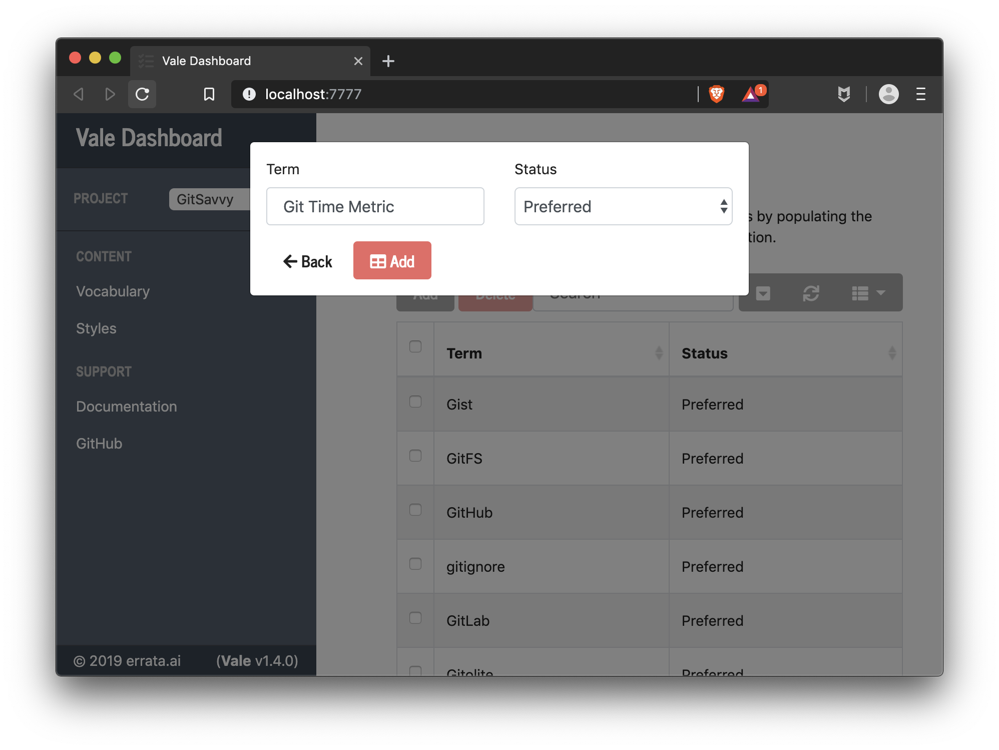

The field of "automated writing aids" is getting to be a crowded space: there's certainly no shortage of software claiming to offer "human-level" detection of spelling and grammar mistakes.

Vale Server is different&mdash;in both philosophy and implementation. The following sections outline exactly *how* its approach and features differ from its competitors.

## Your style, our editor

First and foremost, **Vale Server isn't another automated grammar checker**. It doesn't attempt to teach you *how* to write; it's a tool *for* writers.


More specifically, Vale Server focuses (primarily) on writing *style* rather than its grammatical correctness. It works by enforcing *rules* (see [Styles 101](style)) that are defined in simple [YAML](https://yaml.org/) files:

```yaml
# Headings.yml
message: "'%s' should use sentence-style capitalization."
level: suggestion
scope: heading
match: $sentence
exceptions:
  - Azure
  - CLI
...
```

Multiple rules are packaged together to form *styles* that you can choose to follow. The open-source library of styles currently includes implementations for:

- [The Google Developer Documentation Style Guide](https://developers.google.com/style/);
- [The Microsoft Writing Style Guide](https://docs.microsoft.com/en-us/style-guide/welcome/);
- [`proselint`](https://github.com/amperser/proselint/blob/master/README.md);
- [`write-good`](https://github.com/btford/write-good/blob/master/README.md); and
- [`Joblint`](https://github.com/rowanmanning/joblint/blob/master/README.md).

Of course, you can also create your own using the [extension system](style).

## Syntax-aware and web-ready

Vale Server understands its input at both a syntactic and contextual level. It's built on top of state-of-the-art NLP (natural language processing) technology that makes it possible for rules to target specific sections of text&mdash;such as headings, paragraphs, and sentences.



In addition to its understanding of writing structure, Vale Server also has special support for **Markdown**, **AsciiDoc**, **reStructuredText**, and **HTML**. This support is powered by a scoping system (shown above) that allows Vale Server to intelligently handle markup syntax, including the ability to ignore code, URLs, and other non-prose sections entirely.

## Write *wherever* you want

:::tip Don't see your favorite app?
[Let us know!](https://github.com/errata-ai/vale-server/issues/new) We're actively looking to expand our list of third-party integrations.
:::

Unlike most writing applications, Vale Server doesn't include its own editor&mdash;its functionality is exposed over a server that communicates with other applications (referred to as "clients"). This allows you to use your preferred tools while still using Vale Server to check your content.



Vale Server currently supports checking content through your clipboard (any app), **[Atom](https://atom.io/)**, **[Google Docs](https://www.google.com/docs/about/)**, **[Sublime Text 3](https://www.sublimetext.com/)**, **[Google Chrome](https://www.google.com/chrome/)** (coming soon!), and **[Visual Studio Code](https://code.visualstudio.com/)**.

## Spell check that (actually) works

Vale Server is designed to spell check *real* content. It leverages its understanding of prose and markup to help limit false positives, while also allowing you to create and manage your own project-specific vocabularies:



See the [Dashboard](http://localhost:3000/vale-server/docs/ui#dashboard) to learn more.

## Fast and restriction-free

:::note
Web-based integrations (for example, Google Docs and Google Chrome) tend to see slightly decreased performance.
:::

Vale Server's underlying engine is designed to be *fast*. Performance metrics for various formats and file sizes are given in the table below.

| GitHub Repo      | Format           | Files | Average Size (lines) | 5-Run Average (seconds) |
|------------------|------------------|-------|----------------------|-------------------------|
| [linode / docs](https://github.com/linode/docs)    | Markdown         | 1,067 | 189.376              | 23.713                  |
| [nltk / nltk_book](https://github.com/nltk/nltk_book) | reStructuredText | 43    | 833.372              | 18.662                  |
| [clojure-cookbook](https://github.com/clojure-cookbook/clojure-cookbook) | AsciiDoc         | 196   | 128.408              | 15.237                  |

This sub-second performance means that you don't have to worry about file sizes or loading screens.

## Built with collaboration in mind

Vale Server, fundamentally, is designed to meet custom needs. By allowing nearly every aspect of the application&mdash;for example, rules, styles, and integrations&mdash;to be customized, it's able to provide a highly tailored experience for all its users.

However, even with all the potential for customization, Vale Server's entire [configuration](ini) consists of only two easy-to-share plain text assets. This means that you can easily sync configurations between computers, coworkers, projects, etc.

## An open-source core

<!-- Microsoft.OxfordComma = NO -->

Vale Server and its various components all have open-source issue trackers that typically receive responses in less than 24 hours.

<!-- Microsoft.OxfordComma = YES -->

Maintaining well-supported software is a major priority for the Vale Server project.

## Private and secure

Vale Server's architecture is different from most writing applications and
services: since it has an open-source core, the server-side logic is bundled
*with* the application and runs on `localhost`&mdash;meaning your content never
has to leave your own computer.
