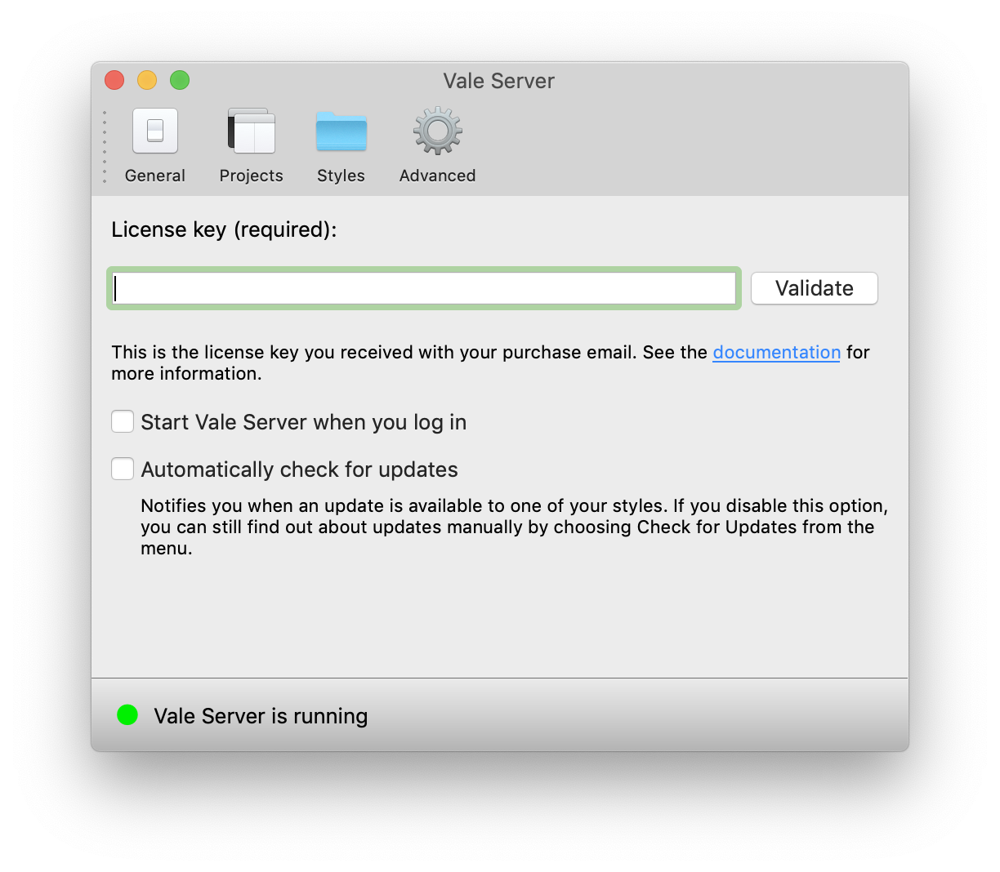
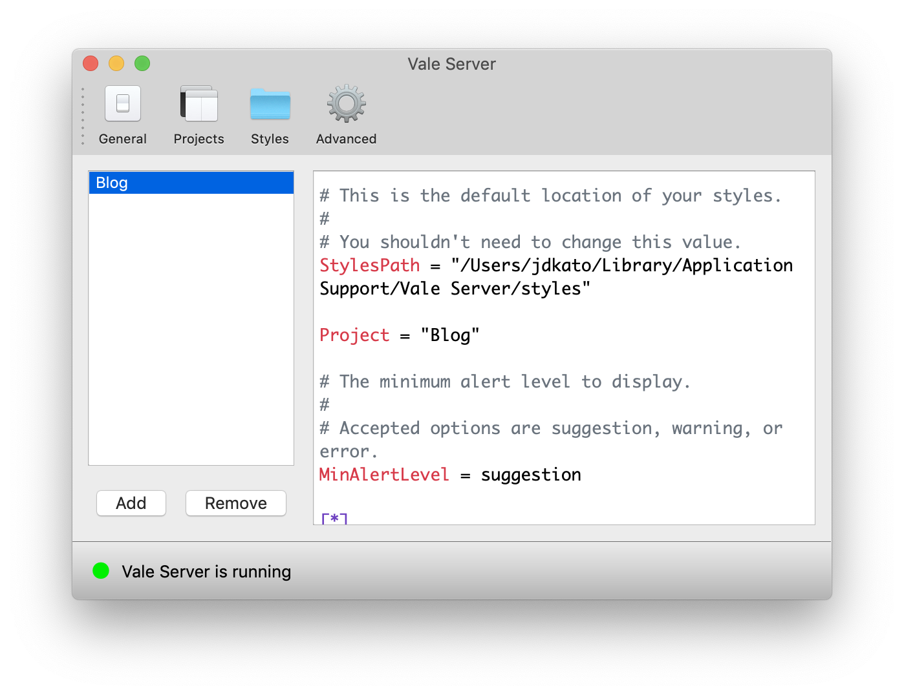
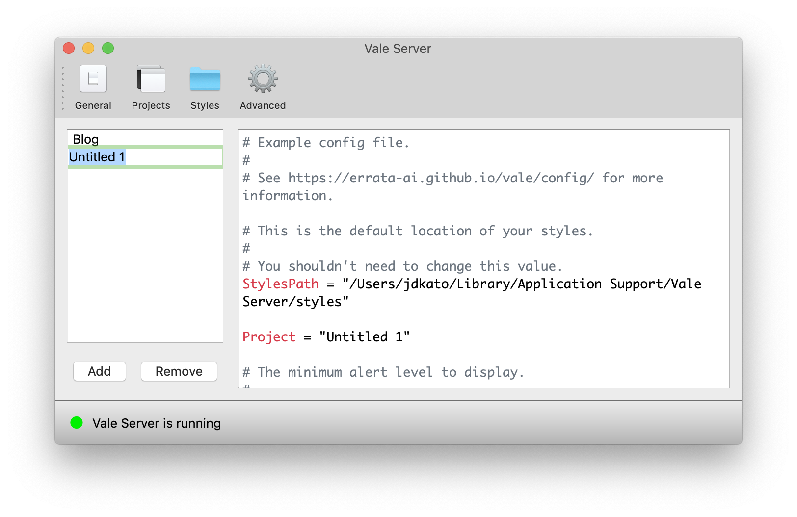
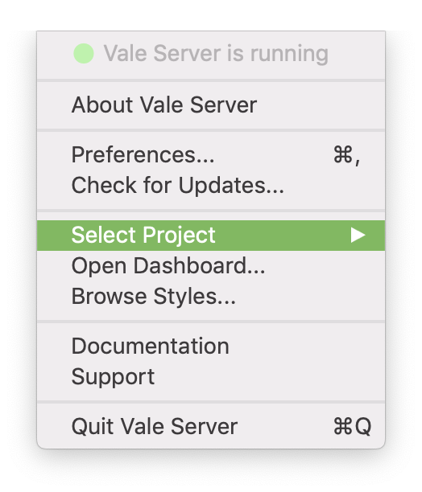
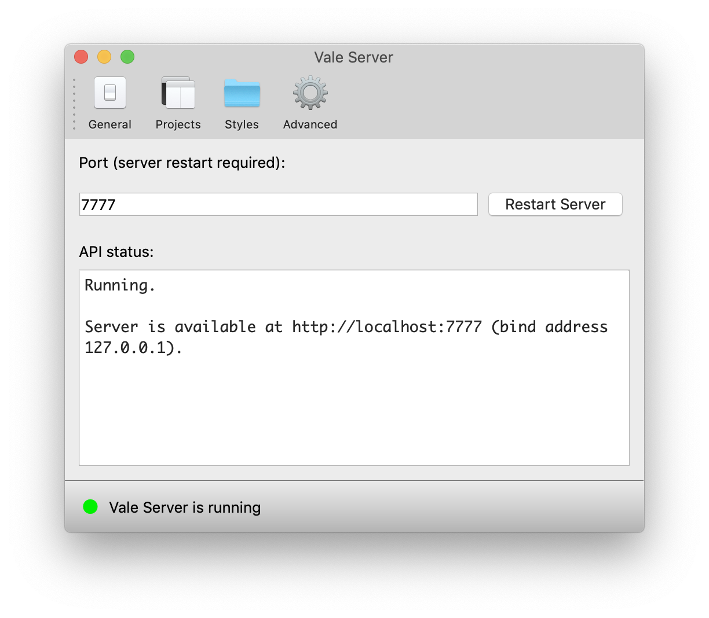
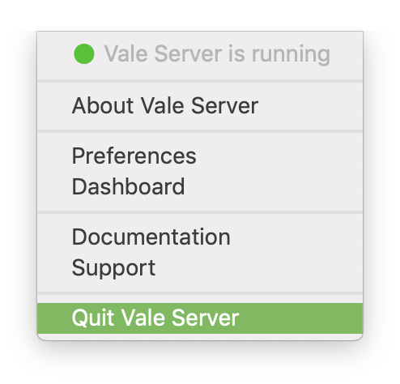

# Get Started with Vale Server for Mac

Vale Server is a standalone desktop application for [Vale][1], a linter for
prose that emphasizes performance, privacy, and extensibility.

```callout{'title': 'NOTE', 'classes': ['tip']}
Vale Server requires at least macOS Sierra 10.12.
```

## Installation

Double-click `Vale Server.dmg` to open the installer, then drag the application
to the Applications folder.


When you open the application, Vale Server will launch in the background at
`http://localhost:7777` (by default) and you will see its icon ()
in your menu bar:


Clicking this icon will open a menu that allows you to
interact with the server.

## Preferences

Choose 
<i class="fas fa-long-arrow-alt-right"></i> **Preferences** from the menu bar and configure the run-time options described
below.


### General



The available options are:

- **Enter your License Key**: In order to use Vale Server, you need to enter a
  valid license key. You'll receive this key in your purchase confirmation
  email.

- **Start Vale Server when you log in**: Check this option if you want Vale
  Server to start when you log in to your Mac.

- **Automatically check for updates**: Check this option if you want to be
  notified when an update is available to one of [your styles](). If you
  disable this option, you can still find out about updates manually by
  choosing  
  <i class="fas fa-long-arrow-alt-right"></i> **Check for Updates**.

### Projects

Projects allow you to manage multiple [Vale configuration files](https://errata-ai.github.io/vale/config/)
in one place. Each project has a name (the left panel) and an associated
configuration file (the right panel):



To create a new Project, click "Add" and then double-click the new project
to give it a name:



You can now edit the configuration file on the right to customize your new
project. To remove a project, click its name and then click the "Remove"
button.

After you've created and configured your projects, you can quickly switch
between them by selecting 
<i class="fas fa-long-arrow-alt-right"></i> **Select Project**:



Additionally, each project also has an associated Vocabulary that you can access
via the [Dashboard]().

### Styles

### Advanced

The Advanced page allows you to configured the port that Vale Server
will listen on:



## Dashboard

## Uninstallation

1. Quit Vale Server via the tray icon:

    

2. Open your Applications folder and drag the Vale Server application to the Trash.

3. Empty the Trash.

## Windows

Coming soon.

## Linux

Coming soon.

[1]: https://github.com/errata-ai/vale
