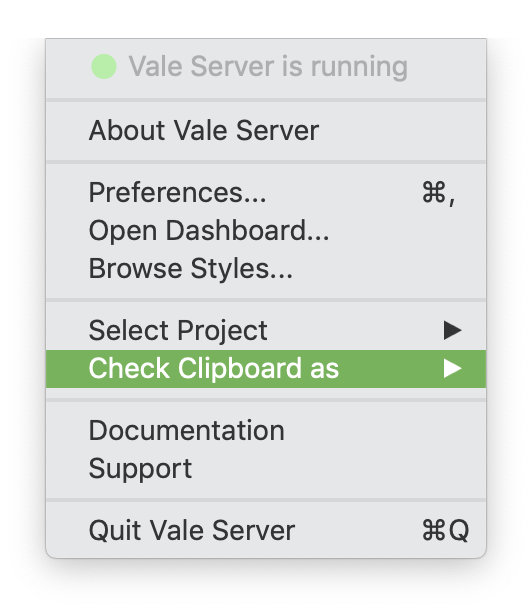

There are two ways to use Vale Server: via the **Check Clipboard as...** menu
option or through a third-party integration.

## Clipboard

The **Check Clipboard as...** option allows you to use your Vale Server
configuration anywhere that supports copy-and-paste (e.g., web
browsers, email clients, content management systems, etc).

To check your content, simply copy it to your clipboard and choose
**Check Clipboard as...** from the menu:

## Integrations

Our third-party integrations provide an enhanced experience for certain
applications. Click on an application below to learn more.

<table style="text-align:center">
  <tr>
    <th>Google Docs</th>
    <th>Sublime Text</th>
    <th>Atom</th>
    <th>VS Code</th>
    <th>Microsoft Word</th>
  </tr>
  <tr>
    <td>
        
    </td>
    <td>
        
    </td>
    <td>
        
    </td>
    <td>
        
    </td>
    <td>
        
    </td>
  </tr>
</table>
